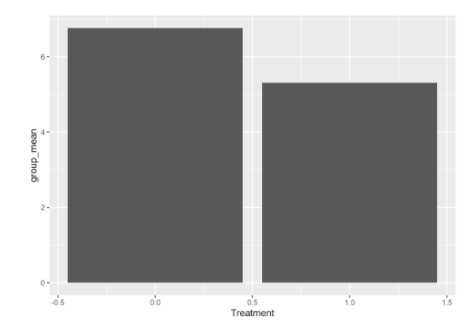
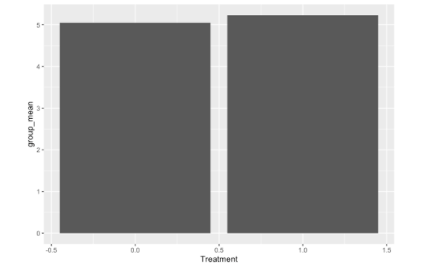
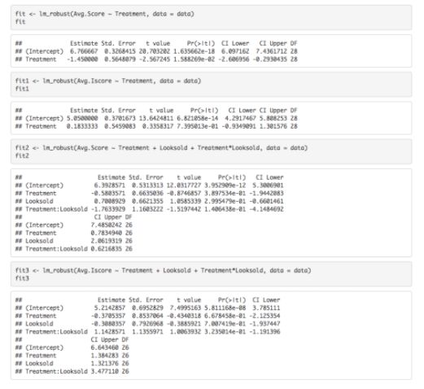
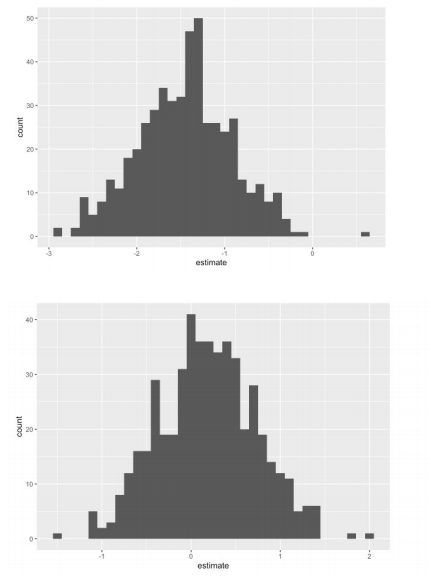
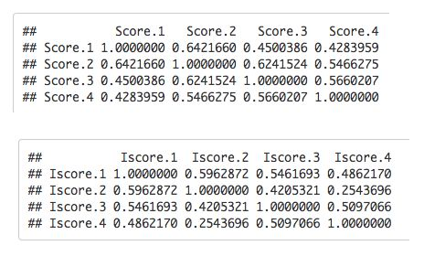

# A Field Experiment on the Effect of Clarinet Reed Clipping

## Introduction:

The clarinet, one of the most commonly-played instruments in the classical and jazz worlds, produces its distinct sound by way of vibrations. These vibrations, produced when air enters the mouthpiece and vibrates the tip of the reed rapidly at different speeds to produce different notes, are largely dependent on the quality and type of reed. In this particular randomized field experiment, we look at the effects of randomly clipping the tips of clarinet reeds on tone quality and intonation of the instrument. By randomly assigning this treatment on many clarinet reeds while keeping others untouched as the control group, I played a short 20-second excerpt from Beethoven’s 6th Symphony in order to consistently evaluate the tone and intonation of each reed. In the end, while the treatment of cutting the reed had a significant effect in terms of tone quality in that the unaltered reeds produced better tone, they had an insignificant effect in terms of intonation; this indicates that shorter reeds tend to have the same intonation patterns as reeds that come out of the box but are inferior in terms of tone quality.

## Theory:

The theory behind my experiment was that clarinet players regularly alter their reeds that come out of the box in order to improve performance in terms of sound quality and intonation. Often, these professional players use sandpaper or scissors in order to make these adjustments so I wanted to see if these practices had any validity to them. Generally, for concert clarinetists, the thinner the tip of the clarinet is, the more responsive it is in terms of producing sounds; because the clarinet reed gets thicker as you go lower, shortening the reed from the top will supposedly make it less responsive and harder to control. Thus, the theory behind this particular randomized field experiment is that reed adjustments, especially in terms of length alterations, will have pronounced effects on the quality of sound that comes from the instrument.

## Design:

In this particular randomized field experiment, I gathered from a collection of wooden cane reeds that I had previously purchased; these reeds were specifically designed to be used on the clarinet and not any other instruments. These reeds were also all of the same brand, type, and reed strength in order to maintain consistency. After gathering 30 of these reeds, I used a random sampling generator in R using the randomizr package to randomly assign treatment of cutting the tips of these clarinet reeds one fourth of a centimeter, which is not enough to completely alter the playability of the reeds, but still large enough to be a significant change. After performing this treatment with the use of a ruler to maintain consistency, I recorded a short excerpt from Beethoven 6th Symphony that lasts for a duration around 20 seconds. After having done this for all of the reeds, I randomly sampled from an audience consisting of my family members (4 people) to listen to a few of the recordings and rate the pleasantness of the tone and the intonation of the instrument on a scale from 1 to 10. Three of my family members, including me, are experienced with classical musical practices, while one is relatively unfamiliar. The four scores for both tone quality and intonation were averaged to create an average tone and intonation score for each of the 30 reeds. All of the recordings were randomly sorted to maintain blindness for the evaluators. This randomization also ensured that any influence from the previous or following recordings on the current evaluation will be completely random.

Another aspect of the experimental design was the involvement of pretreatment covariates. Prior to the randomization and application of treatment, I looked at each of the reeds individually and made an evaluation based on my personal expertise on whether the reeds were classified as old or not. This evaluation was made based on wear marks on the reed, the texture of the reed, and the visual appearance of the reed. Based on these evaluations, I also controlled for pretreatment covariates during my analysis to see whether they had any effect.

## Results:

The group mean difference in Average Tone Score is quite significant as the average score for the untreated reeds was 6.77 while the score for the treated reeds was 5.32.

There was a minimal difference, however, in the Average Intonation Scores  for the untreated reeds and treated reeds as they sat at 5.05 and 5.23 respectively.

After performing linear regression for the Average Tone Score and Average Intonation Score on the treatment variable, we found that there was a statistically significant effect of the treatment only for the Average Tone Score of approximately -1.45. The p-value of 0.74 for the treatment variable on the Average Intonation Score regression was too high to be considered statistically significant. After doing linear regressions on these two scores but adding the looks-old pretreatment covariate as well as the interaction term, we found that none of the coefficients were statistically significant for both of the regression. This means when we consider the pretreatment covariate and the interaction term in the regression, we can’t say that there is a significant effect of the treatment when the Looksold covariate is zero and vice versa. Moreover, we cannot state with statistical significance that the slopes of the regression lines between treatment and pretreatment covariate are different for different values of the covariate. This means that whether a reed appears to be old has little effect overall.

Moreover, upon doing 500 simulations in which we resample the data with replacement, only looking at the treatment variable, we can see that with a sample size of 30, the power for the test of Average Tone score is .754 which is relatively large for a small sample size while the power for the Average Intonation Score is .072, which is extremely small. The graphs of the Average Tone Score and Average Intonation Score simulations are shown below, in respective order.

Lastly, I looked at the correlation between the four scores for both tone and intonation, largely to
see whether the presence of one non-musical evaluator was evident when viewing the
correlations. It did not appear that the musical evaluators’ scores were more highly correlated
with one another than the non-musical evaluator.

## Discussion:

Overall, the implications of the experiment for this theory is that altering reeds to a
degree in which was done in this experiment consistently gives the reeds a poorer tone quality.
On the other hand, this treatment did not seem to have a statistically significant effect on
intonation quality. Thus, it seems that in the grand scheme of things, it is advised to leave reeds
untouched or provide minimal changes in order to preserve the best sound quality. However, it is
worthwhile to note that the performer could unconsciously be altering the way they play the
instrument to accomodate to the state of the reeds which is a covariate that is hard to account for.
This might warrant further investigation and the study may be reinforced by increasing the
sample size of reeds as well as introducing more clarinet players so that the influence of one
player does not have an overbearing effect on the findings of this investigation
